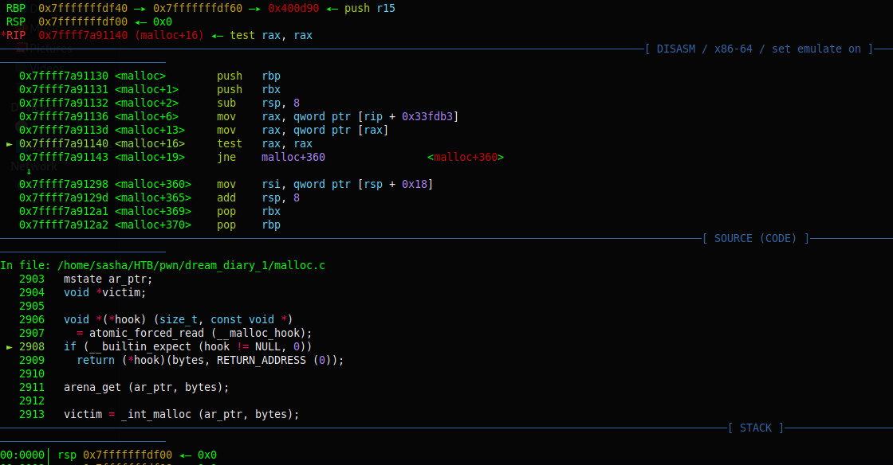

# pwninit.py

A tool for intialization of ctf pwn challenges inspired by https://github.com/io12/pwninit.

## Features

* Downloads the correct interpreter to run the binary.
* Downloads other standard glibc libraries required by the binary, like `libpthread` or `libm` for example.
* Downloads debug symbols and unstrips all libraries, including `libc.so.*`, `ld-linux.so.*`, and other libraries.
* Patches the binary to use the correct interpreter and libraries, either manually or with `patchelf`.
* Writes a solve script to the current directory from a selection of customizable templates.
* Script that fetches glibc source code for better debugging.
* Supports Ubuntu/Debian glibc.

## Install dependencies

Run
```bash
./install_dependencies.sh
pip3 install -r requirements.txt
```
Note: Requires python3.6+ to run

## Usage

### `pwninit.py`

Run `pwninit.py` inside the folder containing the binary (and libraries if they are provided), and it will automatically find the binary and libraries.
You can also specify the binary, libc or interpreter using `-b/--bin`, `--libc` and `--ld`.

### `pwnsrc.py`

This is an additional script which uses the `libc` to download glibc source code files.
This is useful in combination with debug symbols and a debugger like `gdb` which can list the source code relevant to the current point in the program's execution, and is very helpful in cases where you need to debug the inner workings of certain parts of glibc, such as `malloc`, `printf`, `dl-runtime` and more.



Running `pwnsrc.py` the first time will download a `.tar.xz` archive containing the glibc source code, using the libc to get the correct version.
Like `pwninit.py`, `pwnsrc.py` will automatically find the libc, and it can also be specified with `--libc`.

Once the archive has been downloaded, you can start extracting files from it, either manually or by using `--files`.
Any number of files can be specified with `--files`, and it can be the basename (e.g. `malloc.c`) or the full path (e.g. `glibc-2.31/malloc/malloc.c`).

`pwnsrc.py` will automatically find the archive if it exists, or it can be specified with `-s/--source`.

### Custom `solve.py` templates

You can specify which template to use using `-t/--template`.
There are two templates provided by default, but you can change these by adding files or editing files in the `templates` folder, the path of which is also provided when you run `-h/--help`.
The string `{bindings}` in the templates is used to substitute in the `ELF("<binary>")` initializations for the binary, libc and interpreter.

### `config.py`

This file contains some configuration options that can be changed by editing the file.
The options include:
* Names of `binary`, `libc`, `ld` in the `solve.py` template.
* Default `solve.py` template.
* Whether to use `patchelf` by default.

The path of this file is provided when you run `-h/--help`.

### Patching

One major change from the original `pwninit` is that patching the binary is done manually by default.
The major reason for this is that even though `patchelf` is more versatile, it's method of patching can cause side effects for the binary.
This arises because it has to resize and move data sections, and so it means the binary is loaded into memory differently to how it would've been without patching.
While this doesn't usually affect the intended behaviour of the binary, it can sometimes affect exploitation, which is a problem as the whole point of `pwninit` is to simulate the remote environment.
This isn't a very common problem, so in most cases `patchelf` is fine, but personally I have run into issues with `patchelf` in the past.

The way this manual patching is done is effectively a simpler version of `patchelf --replace-needed` and `patchelf --set-interpreter`, but it uses relative paths of symlinks which are shorter than the target strings.

This can be disabled by using `--use-patchelf`.

## Example

```bash
$ ls
chall  libc.so.6
$ readelf -Wd ./chall | grep NEEDED
 0x0000000000000001 (NEEDED)             Shared library: [libc.so.6]
 0x0000000000000001 (NEEDED)             Shared library: [libpthread.so.0]
$ pwninit.py 
[*] bin: chall (arch = 'amd64')
[*] libraries: {'libc': 'libc.so.6'}
[*] libc: libc.so.6
[*] libc version: (Ubuntu GLIBC 2.31-0ubuntu9.2) stable release version 2.31.

[*] Fetching 'libpthread.so.0', 'ld-linux-x86-64.so.2' from https://launchpad.net/ubuntu/+archive/primary/+files/libc6_2.31-0ubuntu9.2_amd64.deb
[+] Successfully fetched 'libpthread.so.0'
[+] Successfully fetched 'ld-linux-x86-64.so.2'

[*] Finding stripped libraries to unstrip
[*] Unstripping 'libc.so.6', 'libpthread.so.0', 'ld-linux-x86-64.so.2'
[*] Fetching debug symbols from https://launchpad.net/ubuntu/+archive/primary/+files/libc6-dbg_2.31-0ubuntu9.2_amd64.deb
[+] Successfully unstripped 'libc.so.6'
[+] Successfully unstripped 'libpthread.so.0'
[+] Successfully unstripped 'ld-linux-x86-64.so.2'

[*] Patching binary
[*] Symlinking './ld' -> 'ld-linux-x86-64.so.2'
[*] Symlinking './libc' -> 'libc.so.6'
[*] Symlinking './libpthread' -> 'libpthread.so.0'
[+] Successfully wrote patched binary to 'chall_patched'

[*] Writing solve.py
[+] Successfully written solve.py
$ ls
chall  chall_patched  ld  ld-linux-x86-64.so.2  libc  libc.so.6  libpthread  libpthread.so.0  solve.py
```
